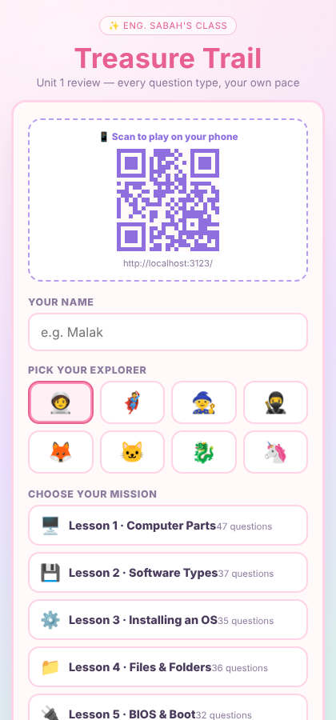
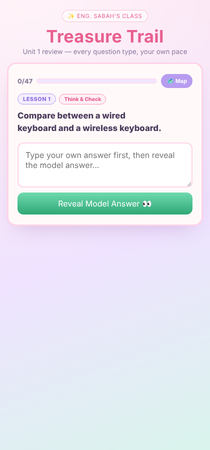

# 🏴‍☠️ Treasure Trail

**A full-stack classroom review game — Next.js, Postgres, and a live teacher dashboard.**

**Live demo:** [treasure-trail-quiz.vercel.app](https://treasure-trail-quiz.vercel.app)

Built for WE ATS Grade 1 / Unit 1 (Basic Computer Hardware & Software) by
Eng. Sabah, to turn a 275-question exam bank into something students actually
want to practice: a treasure-hunt race against ghost rivals, with every
question rendered in the UI that fits it, not a one-size-fits-all quiz form.

<p align="center">
  
  
</p>

## What it does

- **All 275 Question Bank items**, packaged as 260 interactive questions —
  the 5 "match the column" groups each became one matching exercise holding
  all 4 of their pairs, so no content was dropped, just combined.
- Mixed question types, each with its own UI: True/False, Multiple Choice,
  Fill-in-the-blank, Matching (tap-to-pair), and Essay/Compare (type-then-reveal
  self-check).
- Mission picker: play one lesson at a time, or the full marathon.
- Streak counter + confetti celebration on reaching the treasure.
- Race Map screen with ghost rivals, paced to the chosen mission's length.
- Every finished game is saved to a Postgres database, with a `/results`
  page for the teacher to see every student's score.
- A live `/teacher` dashboard updates every 5 seconds while students are
  playing — name, avatar, lesson, progress bar, current score, and streak —
  separate from the finished-games history at `/results`. Both pages are
  behind a single shared password (see step 4 below).
- A QR code (pointing at the page's own URL) shows on the start and end
  screens, and disappears while a student is mid-quiz.

## Stack

Next.js 14 (App Router) · React · Postgres via Neon (`@neondatabase/serverless`)
· Edge middleware for password auth · `canvas-confetti` · `qrcode.react` ·
deployed on Vercel.

## Deploying on Vercel (first time)

1. **Import the project**
   - Go to [vercel.com/new](https://vercel.com/new) and import this GitHub
     repository (`treasure-trail-quiz`).
   - Framework preset: Next.js (detected automatically). Click **Deploy**.
   - The first deploy will work for playing the game, but scores won't save
     yet — that needs a database (next step).

2. **Add a Postgres database**
   - In your Vercel project, open the **Storage** tab.
   - Click **Create Database** → choose **Postgres** (Vercel's own, powered
     by Neon) → create it, and **Connect** it to this project.
   - Vercel automatically adds the `POSTGRES_URL` (and related) environment
     variables — no manual setup needed.
   - Go to **Deployments** → redeploy the latest deployment (or just push
     any commit) so the app picks up the new environment variables.

3. **Set a teacher password**
   - In **Settings → Environment Variables**, add `TEACHER_PASSWORD` with
     any password you choose (e.g. `trail2026`).
   - Redeploy once more so it takes effect.

4. **Done**
   - Open your deployment's URL — that's the link/QR code students scan.
   - Visit `/teacher` on the same domain any time to watch students'
     progress live (updates every 5 seconds) — you'll be asked for the
     password you set above once per device.
   - Visit `/results` for the full history of finished games.

## Local development

```bash
npm install
npm run dev
```

Without a `POSTGRES_URL` env var set locally, the game itself still works —
only the save-to-database call (and the `/results` page) need the database.

## Project structure

- `app/page.js` — the game page
- `components/GameApp.jsx` — game state machine (start/game/end screens)
- `components/QuestionCard.jsx` — per-type question UI (TF/MCQ/Fill/Match/Essay)
- `components/QRBox.jsx` — the QR code box
- `app/api/results/route.js` — saves/lists results (Postgres)
- `app/results/page.js` — teacher's results table
- `data/questions.json` — all 260 question records

## License

The code is released under the [MIT License](LICENSE). The question content in
`data/questions.json` comes from the WE ATS Grade 1 curriculum exam bank and is
not covered by that license.

## Author

Eng. Sabah Gomaa — [GitHub](https://github.com/Engsabah37) · [LinkedIn](https://www.linkedin.com/in/sabah-gomaa-90a8361b7)
